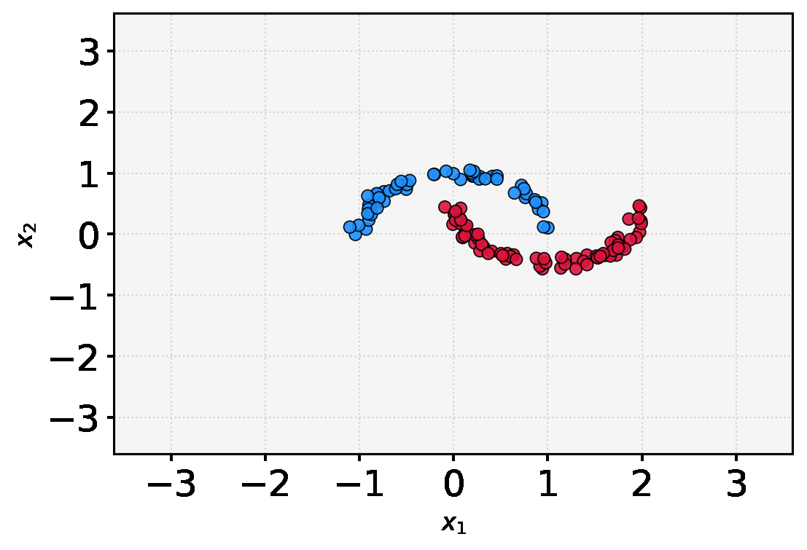

# robust neural ODEs

Start with tutorials to get familiar with the code

* Tutorial 1: Train a neural ODE based network on point cloud data set and generating a gif of the resulting time evolution of the neural ODE

Code is based on a branch of https://github.com/borjanG/2021-dynamical-systems
that uses the torchdiffeq package https://github.com/rtqichen/torchdiffeq